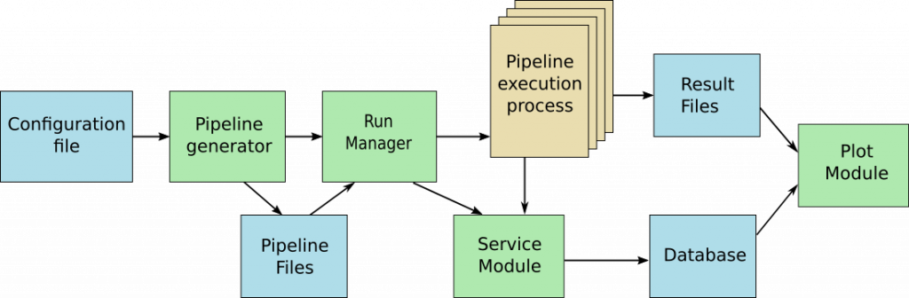

## Documentation

#### Introduction

Mosaic is a framework dedicated to the comparison of AI models. It is often very difficult to choose the best AI model for a specific problematic and multiple options are available, including choices over the model hyper-parameters. It is tempting to try different options and to compare them to get the best performance/resource ratio. But this kind of test can be pretty time consuming from the developper point of vue. The Mosaic framework eases the automation of the program generation and provides tools to help the study (Database, plot system…)

Mosaic is a python framework based on Pytorch. From a simple configuration file, a set of pipelines is generated including all the steps of the data treatment (data loading, formatting, normalization, post-treatment…) and the model training itself. The framework executes all these pipelines in a parallel way and store all the results in a database and in differents files. Some facility are offered to pause/resume and monitor the run. A plot module helps getting some compact and graphical representations to ease the interpretation of this data.




#### Installation

The installation can be done with the pip utilitary

```bash
pip3 install ml-mosaic
```

#### Type of files

Mosaic is using heavily different types of files for configuration, data, databse (squlite3), generation and results.

- json : Pipeline files
- ini : Configuration files
- py : Classes files
- mdt : Metadata files
- pt : Files saved by Torch (torch.save), for example runs history, models...
- log : Standard output files of the runs
- pdf : Plot files
- db : Database file

#### Pipelines

The pipelines are generated by the Mosaic framework to represent all the tests that are necessary to compare the different models. They are generated from the configuration file.
They are basically representing a chain of treatments that is applied to the data. All building blocks of such treatments are parametrized and the pipeline aggregated all this informations to fully caracterize a run.
The communication between the different treatments is done via a pipe scheme, the result of a class is transmitted to the next one.
The class argument is simply the name of the class of the treatment. The type argument is arbitrary but should be set carefully. If two different treatments have the same type, they will be used concurently to be compared.

The following example shows a typical pipeline with only two elements. The first one is a dataset (OR logical operator output) and the second is a multi-layer perceptron that will be applied on the data.

```json
[
	{
		"type": "dataset",
		"class": "dataset_OR",
		"path_to_class": "./mosaic/share/dataset.py",
		"batch_size": "1",
		"data_size": "200",
		"train_prop": "0.8",
		"key": "data_dataset_OR"
	},
	{
		"type": "mlp",
		"class": "mlp_funnel",
		"path_to_class": "./mosaic/share/mlp.py",
		"length": "4",
		"width": "2",
		"key": "mlp_mlp_funnel",
		"name": "mlp_funnel"
	}
],
```

#### Configuration File

The configuration files contains all the necessary informations to generate and train the pipelines. This informations are groupes by sections which name are between brackets. Some sections are dedicated to the system itself to specify the training itself. The others are dedicated to the pipeline generation.

The [PROCESS] section contains the informations about the run process and their output. It is mandatory in the configuration file. It must contains the following fields:
- *lr* : The learning rate
- *epochs* : The number of epochs for each run
- *data_scheme* : This is the template of the data generation pipeline. Every block is connected to the next one (sending its output). The last one has the responsability to return a tuple of two dataloaders. Every element of this scheme must be a type of an object existing in the configuration file.
- *pipeline_scheme* : This is the template for the treatment pipeline.
- *run_files_path* : This is the path of a folder where the result files will be stored

The [MONITOR] section contains the information for the core of the Mosaic framework. IT is mandatory in the configuration file. It must contains the following fields
- *need_gpu* : Specify is a GPU is mandatory for executing the training
- *gpu_available* : This parameter is the list of the available gpu (in Torch format example: cuda:0)
- *nb_processus* : Number of parallel process to use during the training (it must be the size of the previous list in case of GPU training)
- *multiplicity* : Specify the number of times a training must be repeated (for statistical reason)
- *cache_database_path* : Specify the path where the cache system stores its files
- *cache_size* : Cache system storage size. The cache manage this storage by suppressing old unused files. The size must be specified with their unit (T for Tera, G for Giga, M for Mega)

The other sections are dedicated to the classes. They must contain at least the following fields:
- *type* : Specify the type of the class. This must be one of the name in the pipeline schemes. Different class can have the same type. This way they will be tested concurently.
- *class* : Name of the class to import
- *path_to_class* : Path to the class python file
- *key* : This parameter allow to give a name to pipelines and group them to facilitate analysis. This will be added to the database under the name `keyname_{section_argument_name}`

For the class sections, the values can be replaced by ranges. In that case all the different values generated from the range will be tested. They are mix of 3 different structures:
- `range` : {min-max} 
- `list` : string1, string2, string3
- `numeric list` : 1, 2, {4-10}


For example, if a section mlp has a "depth" parameter defined like 
```
[mlp]
...
depth = 2, 3, 4
...
```
Then 3 runs will be performed using the 3 different depths.


#### Classes type data_scheme

The datasets must be provided by classes. Such a class must implement different methods that will be called by the Mosaic core to prepare and provide data to the training.  

Mandatory methods
- `prepare(self, data, run_info, module_info)`
	This method handles the creation or the gathering, and the formatting of the data. It returns two Torch dataloaders: *train* et *test* as a tuple (train, test)
- `info(self)`
	This methods generates the informations that will be sent to the next step in the pipeline. Its output is a dictionary containing at least the batch_size parameter but also all necessary informations depending on the need of the developper. If a variable is used as a parameter by another class, the name of the variable must be exactly the same as the name of the parameter in the class.

Si votre classe a besoin de télécharger un fichier avec un url, il est conseillé d'utiliser `mosaic.lib.download_file(url, path)` qui fonctionne avec un cache afin de ne pas télécharger plusieurs fois le même fichier. Cette fonction vous renverra le chemin vers le fichier demandé.

#### Classes type pipeline_scheme

The models that will be compared must be provided as classes. They need to provides four mandatory methodes:
- `forward(self, data, run_info, module_info)`
	This method will apply the model on the data.
        The data parameter comes from the previous block
        run_info is a dictionary generated by the previous blocks
        module_info is a dictionary containing all informations from the configuration file.
        It returns the output of the model
- `info(self)`
	Returns all the parameters needed by the next blocks in the pipeline
- `save_model(self, path)`
	This method save the model parameters in a file specified by the path (the path should contain the folder, the name and extension of the file). The used format is free.
- `load_model(self, path)`
	This method load a previouly trained model. It should of course be compatible with the save_model method.
- `parameters(self)`
	If the class inherit from the torch.nn.Module. Returns the parameters of the models.


#### Commands

The mosaic framework does not have a unified graphical interface. All the actions are triggered by CLI commands

- `mosaic_run`
	Generate the pipelines and execute the corresponding runs.
	*config_file*: Configuration file (.ini) as specified in the corresponding section.
	*database_file*: Database file (.db) where the parameters and results are stored. The file is created if it does not exist. If it already exists, the results are added to allow a combined analysis.


- `mosaic_rerun`
	Relaunch certain pipelines if necessary (typically if the training is not finished with the specified number of epochs). In that case, the model is loaded from files and the training restart where it has been left.
	*config_file*: Configuration file (.ini) which contains at least a MONITOR section
	*database_file*: The databse that has been used for the first run.
        *-epochs EPOCHS*: The number of epochs for the rerun
	Mutually exclusive required arguments:
		- *-id ID,RANGE,LIST*: The ids of the runs to relaunch
		- *-request SQL_REQUEST*: A SQL request on the database giving the list of ids
		- *-param_name_and_value NAME VALUE*: Relauch the ids wich contains the param_name and the param_value
		- *-param_name_and_value_low_threshold NAME VALUE*: Relaunch the ids wich contains param_name and the param_value is lower that the threshold value
		- *-param_name_and_value_high_threshold NAME VALUE*:  Relaunch the ids wich contains param_name and the param_value is higher that the threshold value

- `mosaic_status`
	print the status of the current runs

- `mosaic_pause`
	Pause the actual execution. The command waits for the running pipelines to finish.
        *pipeline_file*: Pipeline file (json) where are stored the non executed pipelines


- `mosaic_resume`
	Relaunch the execution (previously paused by mosaic_pause)
        *pipeline_file*: Pipeline file (json) generated by the pause command

- `mosaic_savedb`
	Save the database during the execution. For integrity reason, the database should not be externally modified during an execution.
	*database_copy_path*: Path to save the database copy.

- `mosaic_plotloss`
	Create a pdf file containing all the loss plots for all the specified runs. 
        *database_file*: The database file created during the executions
	*pdf_path*: The path of the result file
	*run_files_path*: The path to the run result files (as specified in the configuration file)
        *-plot_size*: The number of plots by page (plot_size * plot_size)
	Mutually exclusive required arguments:
		- *-id ID,RANGE,LIST*: The ids of the runs to relaunch
		- *-request SQL_REQUEST*: A SQL request on the database giving the list of ids
		- *-param_name_and_value NAME VALUE*: Relauch the ids wich contains the param_name and the param_value
		- *-param_name_and_value_low_threshold NAME VALUE*: Relaunch the ids wich contains param_name and the param_value is lower that the threshold value
		- *-param_name_and_value_high_threshold NAME VALUE*:  Relaunch the ids wich contains param_name and the param_value is higher that the threshold value


- `mosaic_metaplot`
	Create a pdf file containing comparison plots.
	*database_file*: Database file
	*output_file*: result file path
	*dataset_key_criterion*: name of the dataset key
	*param_criterion*: name of the studied parameter (train_loss, test_loss, train_acc, test_acc, nb_params, duration(s), epochs, overfit, trainability, slope)

- `mosaic_rekey`
	Change the keys of the runs in the database
        *pipeline_file*: Pipeline file (json) containing the pipelines to change in the database (created with mosaic_generate)
	*database_file*: Databse file to modify

- `mosaic_generate`
	Generates a pipeline file from a configuration file
	*config_file*: Configuration file (.ini)
	*pipelines_file*: Result file (json)

#### Database

The database is a squlite3 file which contains 4 tables

- `system`
	Contains informations for the run management. Should not be modified.
- `params`
	Contains all the parameters associated with the runs.
	Format : `run_id | param_name | param_value`
- `runs`
	Contains the status of the runs during an execution
	Format : `run_id | status | pipeline | return_status`
- `run_results`
	Contains the results of the runs
	Format : `run_id | train_loss | test_loss | train_acc | test_acc | nb_params | duration(s) | epochs | overfit | trainability | slope`
