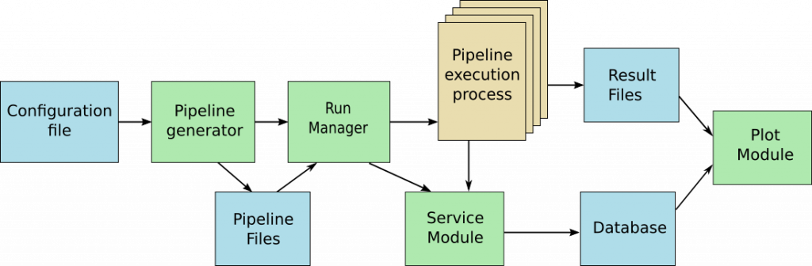

## Documentation

#### Introduction

Mosaic is a framework dedicated to the comparison of AI models. It is often very difficult to choose the best AI model for a specific problematic and multiple options are available, including choices over the model hyper-parameters. It is tempting to try different options and to compare them to get the best performance/resource ratio. But this kind of test can be pretty time consuming from the developper point of vue. The Mosaic framework eases the automation of the program generation and provides tools to help the study (Database, plot system…)

Mosaic is a python framework based on Pytorch. From a simple configuration file, a set of pipelines is generated including all the steps of the data treatment (data loading, formatting, normalization, post-treatment…) and the model training itself. The framework executes all these pipelines in a parallel way and store all the results in a database and in differents files. Some facility are offered to pause/resume and monitor the run. A plot module helps getting some compact and graphical representations to ease the interpretation of this data.



#### Type of files

- json : Tous les fichiers de pipeline
- ini : Fichier de configuration
- py : Fichiers des classes
- mdt : Fichiers de métadata
- pt : Fichiers sauvegardés par torch.save, comme l'historique des runs
- log : Fichiers de sortie stdout et stderr des runs
- pdf : Fichier de stockage des plots
- db : Fichier de base de données

#### Pipelines

Les pipelines sont des combinaisons d'arguments associés à des classes et indique l'ordre dans lequel les classes doivent être utilisées. Ces classes peuvent générer ou renvoyer de la donnée ou la transformer et sont crées par l'utilisateur selon certaines règles decrites dans les sections [classes type data_scheme](#classes-type-datascheme) et [classes type pipeline_scheme](#classes-type-datascheme).

Exemple d'une pipeline d'entrainement d'un mlp funnel sur un dataset d'opérateur logique OR. Les pipelines sont issues du fichier de configuration.

```json
[
	{
		"type": "dataset",
		"class": "dataset_OR",
		"path_to_class": "./mosaic/share/dataset.py",
		"batch_size": "1",
		"data_size": "200",
		"train_prop": "0.8",
		"key": "data_dataset_OR"
	},
	{
		"type": "mlp",
		"class": "mlp_funnel",
		"path_to_class": "./mosaic/share/mlp.py",
		"length": "4",
		"width": "2",
		"key": "mlp_mlp_funnel",
		"name": "mlp_funnel"
	}
],
```

#### Classes type data_scheme

Il faut obligatoirement défnir les méthodes suivantes:
- `prepare(self, data, run_info, module_info)`
	- Fonction qui gère la création ou la récupération des données ainsi
	que le formatage en deux sous-datasets: *train* et *test*
	- Elle renvoie (train, test)
- `info(self)`
	- Fonction qui permet de faire passer des informations à la suite de la pipeline.
	- Elle renvoie un dictionnaire avec au minimum le **batch_size** du dataset ainsi
	que les autres valeurs dont vous avez besoin pour dans les autres classes.
	Si une variable est utilisé en tant que paramètre dans une autre classe, il faut absolument
	que la clé soit exactement la même que le nom du paramètre.

#### Classes type pipeline_scheme

if faut obligatoirement définir les méthodes suivantes :
- `forward(self, data, run_info, module_info)`
	- Méthode qui va transformer la donnée *data* donné en paramètre. run_info et module_info sont
	respectivement:
		Les informations du run en cours transmises via les méthodes info des modules précédents dans la pipeline
		Les informations du module dans le fichier de configuration 
	- Retourne les données transformées
- `info(self)`
	- Tout comme les classes dataset, info retourne un dictionnaire contenant les informations utiles
	aux modules qui sucède dans la pipeline.
- `save_model(self, path)`
	- Méthode qui permet de sauvegarder le modèle de la façon que le souhaite. Il faut impérativement
	ajouter une extension au path qui ne contient uniquement le nom du fichier normalisé.
	- Ne retourne rien
- `load_model(self, path)`
	- Méthode qui permet de charger le modèle précédement sauvegardé par *save_model*.
	Il faut également ajouter l'extension au path donné en paramètre
	- Ne retourne rien
- `parameters(self)`
	- Uniquement si la classe n'hérite pas de torch.nn.Module
	- Renvoie les paramètres du modèle

#### Fichier de configuration

*Dans le fichier de configuration, une section est définie par un nom entre crochet suivi d'une série d'arguments*

Un fichier de configuration doit posséder obligatoirement les sections suivantes:
- `PROCESS`
	- Cette section doit obligatoirement contenir:
		- *lr* : Le learning rate
		- *epochs* : Le nombre d'epochs pour chaque runs
		- *data_scheme* : La séquence de classe à enchainer dans la pipeline qui sont de type donnée.
		Chaque module prend comme input l'output du module précédent et le dernier doit obligatoirement
		renvoyer deux DataLoader qui correspondent à un jeu d'entrainement et un jeu de test.
		- *pipeline_scheme* : La séquence de transformateurs de la donnée. Les modules s'enchainent de la
		même façon que pour le data_scheme. L'input est l'output du module précédent.
- `MONITOR`
	- Cette section doit obligatoirement contenir:
		- *need_gpu* : Permet de savoir si il faut passer en mode GPU et utiliser la section suivante,
		gpu_available
		- *gpu_available* : Vide si il n'y en a pas besoin et une liste contenant le nom des gpus sinon.
		- *nb_processus* : Permet de parralléliser les runs. Si *need_gpu* est True, le nombre de processus
		correspond au nombre de GPUs que l'on veut utiliser. Sinon au nombre de CPUs
		- *multiplicity* : Permet de répéter chaque runs

Les autres sections réservées aux classes doivent obligatoirement contenir:
- *type* : Indique le type de la classe qui se trouve parmis ceux dans data_scheme ou pipeline_scheme et permet de faire les combinaisons de modules.
- *class* : Nom de la classe à importer
- *path_to_class* : Chemin vers le fichier qui contient la classe
- *key* : Permet de faciliter les requêtes dans la base de donnée. Peut être utilisé de la façon suivante
	`keyname_{section_argument_name}`
Où la partie entre crochet sera remplacé par la valeur de l'argument dans la même section du fichier de configuration


Pour les sections réservés aux classes, les valeurs peuvent être de différents types:
- `string`: string
- `range` : {min-max} 
- `list` : string1, string2, string3
- `numeric list` : 1, 2, {4-10}

Si une liste est entrée comme une valeur dans la section d'une classe, alors, à la création des pipelines,
la classe sera multipliée autant de fois que de valeurs dans la liste.
```
Exemple:
Si ma section mlp possède un paramètre depth comme ceci

[mlp]
...
depth = 2, 3, 4
...

Alors, 3 runs vont se lancer, un pour chaque depth de mlp
```

#### Commandes

- `mosaic_run`
	Permet de lancer les pipelines générées grâce au fichier de configuration.
	- Positional arguments:
		- *config_file*: Un fichier .ini qui contient la structure présenté plus haut
		- *database_file*: Un fichier .db est créé si il n'existe pas et sinon, sauvegarde à la suite de celui donné en paramètre

- `mosaic_rerun`
	Permet de relancer certaines piplines en fonction des arguments de la commande.
	- Positional arguments:
		- *config_file*: Un fichier .ini qui contient au minimum la section MONITOR du fihcier de config.
		- *database_file*: Un fichier .db existant dans lequel le binaire va aller chercher les informations pour relancer le run
	-  Mutually exclusive required arguments:
		- *-id ID,RANGE,LIST*: Les ids à relancer
		- *-request SQL_REQUEST*: Une requête SQL qui renvoie des ids
		- *-param_name_and_value NAME VALUE*: Relancer des ids qui correspondent à une section de paramètre dans la base de donnée
		- *-param_name_and_value_low_threshold NAME VALUE*: Relancer les ids sont inferieur à la valeur VALUE de la clé NAME dans la base de donnée
		- *-param_name_and_value_high_threshold NAME VALUE*: Relancer les ids sont superieurs à la valeur VALUE de la clé NAME dans la base de donnée
	- Keyword argument:
		- *-epochs EPOCHS*: Le nombre d'epochs à relancer

- `mosaic_status`
	Permet d'afficher l'état des runs en cours.

- `mosaic_pause`
	Permet de mettre en pasue les runs actuels. Il faudra cependant attendre que les pipelines en cours d'execution se terminent. 
	- Positional arguments:
		- *pipeline_file*: Fichier json où seront stockées les pipelines non executées

- `mosaic_resume`
	Permet lancer des runs à partir d'un fichier de pipeline.
	- Positional arguments:
		- *pipeline_file*: Fichier json qui contient des pipelines

- `mosaic_savedb`
	Permet de faire une copie de la base de donnée pendant que les runs sont lancés.
	- Positional arguments:
		- *database_copy_path*: Chemin de sauvegarde de la base de donnée

- `mosaic_plotloss`
	Permet d'afficher dans un pdf toutes les courbes de loss en fonction des paramètres de la commande.
	- Positional arguments:
		- *database_file*: Un fichier .db existant dans lequel le binaire va aller chercher les informations pour relancer le run
		- *pdf_path*: Chemin de sauvegarde du pdf 
	-  Mutually exclusive required arguments:
		- *-id ID,RANGE,LIST*: Les ids à afficher
		- *-request SQL_REQUEST*: Une requête SQL qui renvoie des ids à afficher
		- *-param_name_and_value NAME VALUE*: Afficher des ids qui correspondent à une section de paramètre dans la base de donnée
		- *-param_name_and_value_low_threshold NAME VALUE*: Afficher les ids sont inferieur à la valeur VALUE de la clé NAME dans la base de donnée
		- *-param_name_and_value_high_threshold NAME VALUE*: Afficher les ids sont superieurs à la valeur VALUE de la clé NAME dans la base de donnée
	- Default argument:
		- *-plot_size 2*: Le nombre de plots affichés sur chaque page (plot_size * plot_size)

- `mosaic_metaplot`
	Permet de faire un plot pour comparer des modèles à partir d'un dataset. Il affiche le nombre de paramètre des modèles en fonction de critères de la base de donnée.
	- Positional arguments:
		- *database_file*: Nom du fichier de la base de donnée dans laquelle nous voulons aller chercher les informations
		- *output_file*: Nom du ficher de sauvegarde du plot
		- *dataset_key_criterion*: Nom de la clé associé au dataset que l'on veut étudier
		- *param_criterion*: Nom du paramètre que l'on veut étudier :
		train_loss, test_loss, train_acc, test_acc, nb_params, duration(s), epochs, overfit, trainability, slope

- `mosaic_rekey`
	Permet de changer les clés dans la base de donnée en fonction d'un fichier de pipelines.
	- Positional arguments:
		- *pipeline_file*: Un fichier json qui contient les pipelines à changer (a créer avec mosaic_generate)
		- *database_file*: Fichier de la base de donnée que l'on veut modifier

- `mosaic_generate`
	Permet de générer les pipelines dans un fichier grâce au fichier de configuration passé en paramètre.
	- Positional arguments:
		- *config_file*: Fichier de configuration.
		- *pipelines_file*: Fichier json de sauvegarde des pipelines générées

#### Base de donnée

La base de donnée est séparée en 4 tables.
- `system`
	Contient des informations liées au monitoring des runs.
- `params`
	Contient les informations liées aux pipelines. Table requêtable pour faire des reruns.
	Forme : `run_id | param_name | param_value`
- `runs`
	Contient le status des runs
	Forme : `run_id | status | pipeline | return_status`
- `run_results`
	Contient les résultats des runs
	Forme : `run_id | train_loss | test_loss | train_acc | test_acc | nb_params | duration(s) | epochs | overfit | trainability | slope`
