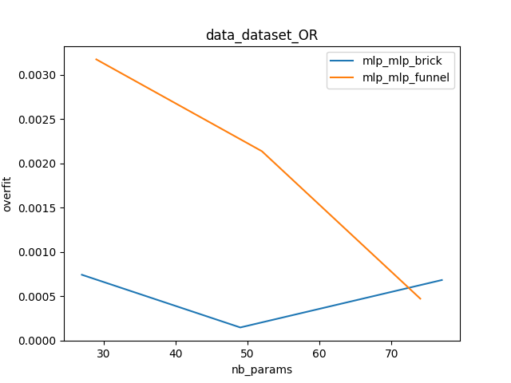

# Tutorial

Let us assume that we want to compare two different architectures of multi-layer perceptron (MLP) on a common dataset to determine which one gives the best results. Mosaic will let us create a configuration file to encode this test. In this tutorial, we will see the complete setup of this experiment, from the class writing to the run execution.

The two models that we consider are simple MLP but the shape of the layers are different. One hase the shape of a funnel (decreasing number of neurons along the layers) and the other one has the shape of a brick (constant number of neurons along the layers). We want to compare them on a basic dataset wich is the logical gate OR. Of course, we want to compare the performances depending on the total number of neurons.

### Step 1
Create the dataset

As stated in the documentation, the class must implement two methods: prepare and infos.

The prepare method is executed at the beginning of every run to generate the data. It should provide two dataloaders containing the train and test data.

The generation of data if straightforward

```python
def prepare(self, data, run_info, module_info):
    data_size = int(module_info['data_size'])
    X = np.array([np.random.randint(2, size=2) for _ in range(data_s
ize)])
    y = np.array([a | b for a, b in X])
    X = torch.tensor(X).float()
    y = torch.tensor(y).float()
    dataset = torch.utils.data.TensorDataset(X, y)
```

Two arrays are created containing input and output for this problem. They are converted in torch datasets. Please note how to get the data_size information from the configuration file. All the needed parameters should be extracted this way.

Then the dataloaders are created and returned by the function. The complete code of the function can be found in the sources (mosaic/share/dataset.py)

```python
	train_loader = torch.utils.data.DataLoader(train_dataset,
	batch_size=self.batch_size, drop_last=True)

	test_loader = torch.utils.data.DataLoader(test_dataset,
	batch_size=self.batch_size, drop_last=True)

	return train_loader, test_loader
```

The info method must also be implemented. It returns a dictionary that contains all informations needed by the system or the other classes in the pipeline. In our case, we output three information, the data size, the input size and the output size. 


```python
def info(self):
	return {'batch_size' : self.batch_size, 'input_size' : 2, 'output_size' : 1}
```

### Step 2

We need to implement the two classes for the two types of MLP we want to compare. Each of them must implement different methods. The __init__ method is the constructor and build the network itself. It takes different arguments that are extracted automatically by the framework from the configuration file (length and width in that case) or the dictionaty built by the other classes in the pipeline (in our case input_size and output_size as seen in step 1).

```python
class mlp_funnel(torch.nn.Module):
      def __init__(self, input_size, output_size, length, width)
      ...
```

Another important method is the forward method, which apply the data on the model
```python
def forward(self, data, run_info, module_info):
	for layer in self.layers:
 		data = self.activation(layer(data))
	return data
```

In our case, the class implements an implied backward method due to its inheritance from the torch.nn.Module. If it is not the case, a backward method, calculating the gradients must be implemented too. It is the same for the parameters method wich return a tensor containing the parameters of the model (for the optimizer).

The info method, which is mandatory, returns a dictionary of parameters as seen in step 1. As the MLP class is the last one in the pipeline, it returns an empty dictionary.

Finally, the methods save_model et load_model has to be implemented to respectively save and load a model. We have chosen a simple call to Torch specialiazed functions but there is no obligation to use this format. 

```python
def save_model(self, path):
	path += '.pt'
	torch.save(self, path)

def load_model(self, path):
	path += '.pt'
	self = torch.load(path)
```

### Step 3

Now that we have all our classes, we need to write the configuration file. It is a ini file with section and parameters inside the sections. The two sections `PROCESS` et `MONITOR` are mandatory and they define parameters for the training loop itself. The parameters are defined in the documentation and will not be detailed here.

```ini
[PROCESS]
lr = 1e-2
epochs = 400
data_scheme = dataset
pipeline_scheme = mlp
run_files_path = .runs

[MONITOR]
need_gpu = False
gpu_available = None
nb_processus = 8
multiplicity = 4
cache_database_path = ./cache.db
cache_size = 1M
```

After this mandatory part, we need to add sections to decribre the classes we want to compare. The mandatory parameters are type, classe, path_to_class, key

For example, for our mlp_funnel class, we write
```ini
[mlp_funnel]
type = mlp
class = mlp_funnel
path_to_class = ./mosaic/share/mlp.py
key = mlp_funnel
length = {2-5}
width = 3
```

The full configuration file can be found in mosaic/share/config.ini. 

The type must be mlp, corresponding to the name appearing in the pipeline scheme. The class correspond to the name of the class in the python file (for import) and the path_to_class is the python file itself. The key is a regular expression allowing to group some results during the analysis phase. The pipeline name could be mlp_funnel_2_3 but we dont want to use that level of detail, just comparing the funnel versus the brick. Thus, we use a simplified key. The keys can be modified after the run by the `mosaic_rekey` command.

The other parameters are the one that will be given to the init method. The width will always be 3. But for the length, different pipelines will get 2, 3, 4 or 5 in order to test all these solutions.

### Step 4

Now we can launch the trainings with the Mosaic commands.

The `mosaic_run` command launch the execution of all the pipeline training following the configuration file.

```bash
>> mosaic_run config.ini database.db
 ---> launch 1 1/24
 ---> launch 2 2/24
 ---> launch 3 3/24
 ---> launch 4 4/24
 ---> launch 5 5/24
 ---> launch 6 6/24
 ---> launch 7 7/24
 ---> launch 8 8/24
 [run finished] 1
 ---> launch 9 9/24
```
As we can see, the output of the mosaic_run command shows the different runs at start and stop.

For integrity reason, it is not possible to open or modify the database during this execution. If one want to make some preliminary analysis, the `mosaic_savedb` command perform a copy of the database as it is. This copy is completely detached from the execution and any operation is allowed on it.

```bash
>> mosaic_savedb database_copy.db
```

During the execution, it is possible to follow its status with the `mosaic_status` command.

```bash
>> mosaic_status
Done
        [1] train_loss=4.171E-11        test_loss=4.074E-11     execution_time=4.670E+01
        [2] train_loss=4.264E-11        test_loss=3.928E-11     execution_time=4.825E+01
        [3] train_loss=4.185E-11        test_loss=4.125E-11     execution_time=4.820E+01
        [4] train_loss=4.065E-11        test_loss=3.964E-11     execution_time=4.841E+01
        [6] train_loss=4.974E-11        test_loss=4.840E-11     execution_time=4.762E+01
        [7] train_loss=4.157E-11        test_loss=4.254E-11     execution_time=4.846E+01
        [8] train_loss=4.084E-11        test_loss=4.036E-11     execution_time=4.784E+01
Error
Running
        [5] dataset_OR(1,200,0.8) | mlp_funnel(4,3)
        [9] dataset_OR(1,200,0.8) | mlp_funnel(4,4)
        [10] dataset_OR(1,200,0.8) | mlp_funnel(4,4)
        [11] dataset_OR(1,200,0.8) | mlp_funnel(4,4)
        [12] dataset_OR(1,200,0.8) | mlp_funnel(4,4)
        [13] dataset_OR(1,200,0.8) | mlp_brick(4,2)
        [14] dataset_OR(1,200,0.8) | mlp_brick(4,2)
        [15] dataset_OR(1,200,0.8) | mlp_brick(4,2)
```


The finished runs are described with their id and their performance. The running runs are described with their id and their pipeline (including all parameters). For the run that have terminated with an error, the backtrace of the error is printed.

If this comes from a bug, it is possible to fix it and to use the `mosaic_rerun` command to relaunch them specifically.

```bash
>> mosaic_rerun config.ini database.db -id 1-3 -epochs 200
```

### Step 5

After the execution (or multiple executions), an analysis can be performed to compare all the results.

The `mosaic_plotloss` command creates a pdf file containing all the loss plot for all the pipelines. This curves permit to check if the training has been finished correctly or if some more epochs are necessary. In that case, the `mosaic_rerun` command can be used.

```bash
>> mosaic_plotloss database.db plotloss_output.pdf .runs -id all -plot_size 3
```

Une partie des résultats de plotloss


The `mosaic_metaplot` command build the comparison plots themselves. The different runs are aggregated to compute statistics and represent the compared performance of the two models. Different values are available to compare. It can be the train or test loss, the running time but also an overfitting indicator, a trainability indicator and a stability indicator.

```bash
>> mosaic_metaplot database.db metaplot.png dataset_OR test_loss
```

Résultat de metaplot
- test_loss

- overfiting


We can deduce from these plots that the brick MLP is really better that the funnel on this dataset.
